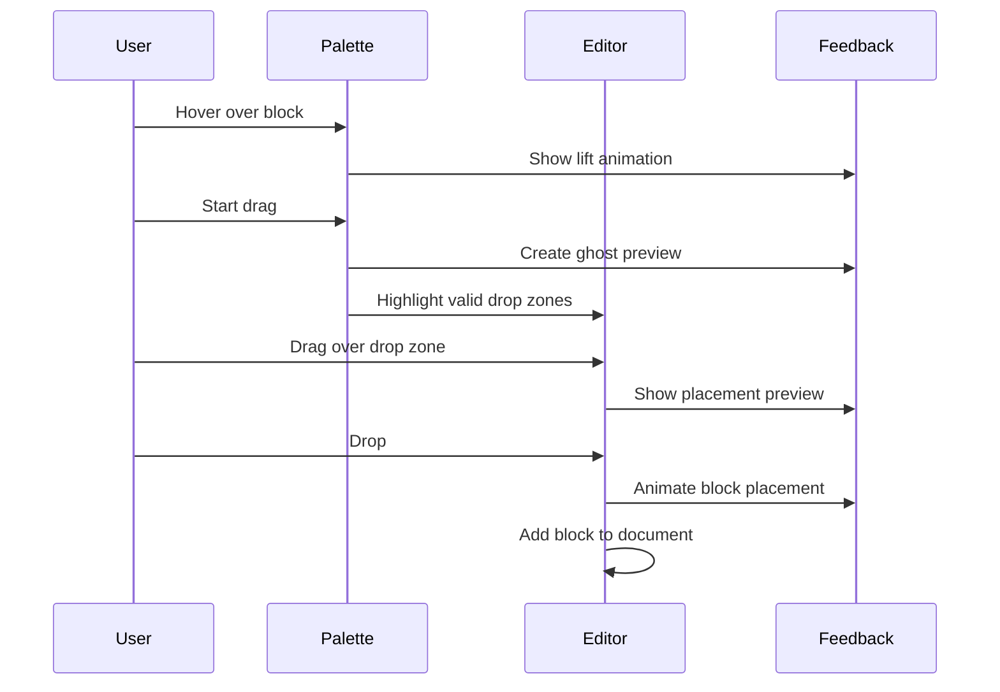
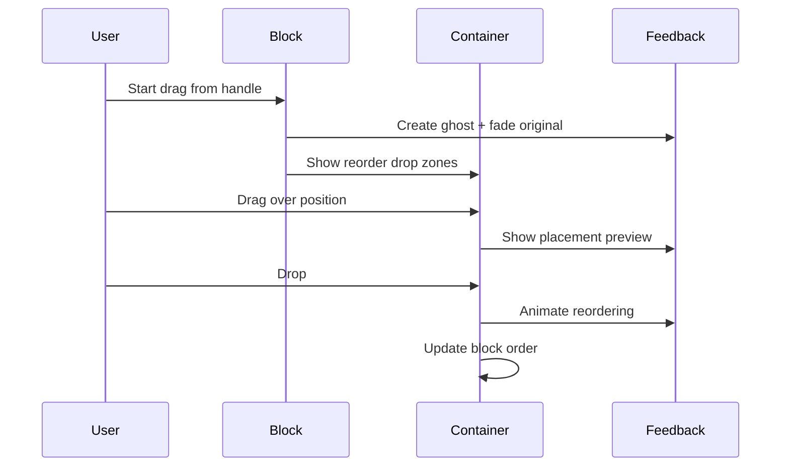
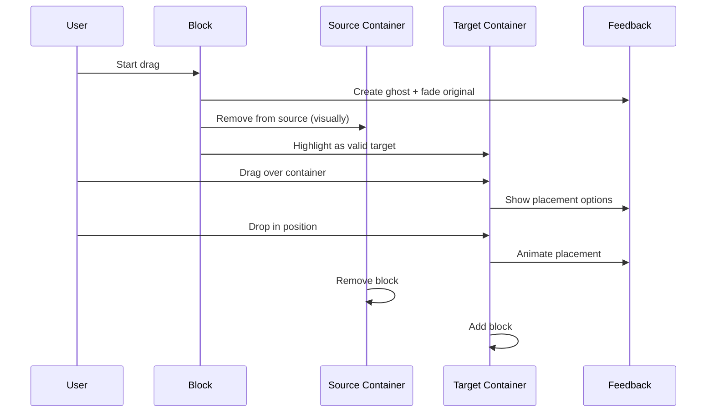

# 🎨 CREATIVE PHASE: Drag & Drop UX Design

## PROBLEM STATEMENT

Необходимо спроектировать интуитивный и эффективный UX для drag-and-drop функциональности в email builder, который:
- Обеспечит плавные и понятные взаимодействия пользователя
- Поддержит различные сценарии перетаскивания (из палитры, между контейнерами, сортировка)
- Предоставит четкую визуальную обратную связь
- Будет работать на десктопе и мобильных устройствах
- Интегрируется с @dnd-kit и Consta design system

## OPTIONS ANALYSIS

### Option 1: Минималистичный DnD с базовой обратной связью
**Описание**: Простая реализация с минимальными визуальными эффектами
**UX паттерны**:
- Drag handle только при наведении
- Простые drop zones без предварительного просмотра
- Базовая подсветка валидных зон
- Стандартные курсоры браузера

**Interaction Flow**:
```
1. Hover на блок → Показать drag handle
2. Начало drag → Изменить курсор
3. Drag над валидной зоной → Подсветить границу
4. Drop → Переместить блок
```

**Pros**:
- Простота реализации
- Быстрая разработка
- Минимальная нагрузка на производительность
- Соответствует стандартным паттернам

**Cons**:
- Недостаточно интуитивно для новых пользователей
- Отсутствие предварительного просмотра
- Ограниченная обратная связь
- Может вызывать ошибки при размещении

**Complexity**: Low
**Implementation Time**: 1-2 недели

### Option 2: Богатый UX с предварительным просмотром
**Описание**: Полнофункциональный DnD с детальной визуальной обратной связью
**UX паттерны**:
- Постоянно видимые drag handles
- Ghost/preview изображения при перетаскивании
- Детальные drop zones с предварительным просмотром
- Анимации и переходы
- Контекстные подсказки

**Interaction Flow**:
```
1. Всегда видимые drag handles
2. Начало drag → Ghost preview + анимация исчезновения оригинала
3. Drag над зоной → Показать preview размещения
4. Hover над контейнером → Показать все возможные позиции
5. Drop → Плавная анимация размещения
```

**Pros**:
- Отличный пользовательский опыт
- Интуитивно понятно
- Минимум ошибок размещения
- Профессиональный внешний вид
- Подходит для сложных сценариев

**Cons**:
- Сложность реализации
- Больше времени на разработку
- Возможные проблемы с производительностью
- Требует больше тестирования

**Complexity**: High
**Implementation Time**: 3-4 недели

### Option 3: Адаптивный UX с прогрессивным раскрытием
**Описание**: Умный UX, который адаптируется к опыту пользователя и контексту
**UX паттерны**:
- Drag handles появляются при наведении для опытных пользователей
- Подсказки и hints для новых пользователей
- Разные уровни детализации обратной связи
- Контекстно-зависимые элементы управления

**Interaction Flow**:
```
1. Первое использование → Показать onboarding hints
2. Hover на блок → Показать drag handle + tooltip
3. Начало drag → Ghost preview (опционально)
4. Умное определение намерения пользователя
5. Адаптивные drop zones в зависимости от контекста
6. Drop → Анимация + optional confirmation для сложных операций
```

**Pros**:
- Подходит для пользователей разного уровня
- Эффективно использует пространство экрана
- Снижает когнитивную нагрузку
- Масштабируется с ростом функциональности

**Cons**:
- Сложность логики адаптации
- Необходимость A/B тестирования
- Сложнее поддерживать
- Может быть непредсказуемо для некоторых пользователей

**Complexity**: Medium-High
**Implementation Time**: 2-3 недели

## DECISION

**Выбираю Option 2: Богатый UX с предварительным просмотром**

### Обоснование:
1. **Целевая аудитория**: Email builder используется для создания важного контента, пользователи ценят точность
2. **Сложность задач**: Email layout может быть сложным, нужна детальная обратная связь
3. **Профессиональный инструмент**: Ожидания высокого качества UX
4. **Конкурентные преимущества**: Богатый UX выделит продукт среди конкурентов
5. **@dnd-kit возможности**: Библиотека поддерживает все необходимые паттерны

## DETAILED UX DESIGN

### 1. Drag Handles Design
```
┌─────────────────────────┐
│ ⋮⋮ Email Block Content │ ← Drag handle всегда видим
│    [Block content...]   │   в левом углу
└─────────────────────────┘

States:
- Default: Subtle gray dots (⋮⋮)
- Hover: Highlighted with Consta primary color
- Active: Consta accent color with slight glow
```

### 2. Drag Preview (Ghost) Design
```
┌─────────────────────────┐
│ ⋮⋮ Email Block Content │ ← 50% opacity
│    [Block content...]   │   Slight shadow
└─────────────────────────┘   Follows cursor
```

### 3. Drop Zones Visualization
```
Valid Drop Zone:
┌─ ─ ─ ─ ─ ─ ─ ─ ─ ─ ─ ─ ─┐
│  ↓ Drop here to add      │ ← Dashed border
│     between blocks       │   Consta success color
└─ ─ ─ ─ ─ ─ ─ ─ ─ ─ ─ ─ ─┘

Invalid Drop Zone:
┌─ ─ ─ ─ ─ ─ ─ ─ ─ ─ ─ ─ ─┐
│  ✗ Cannot drop here      │ ← Dashed border
│                          │   Consta danger color
└─ ─ ─ ─ ─ ─ ─ ─ ─ ─ ─ ─ ─┘
```

### 4. Container Drop Zones
```
Container with children:
┌─────────────────────────┐
│ Container Header        │
├─ ─ ─ ─ ─ ─ ─ ─ ─ ─ ─ ─ ─┤ ← Drop zone
│ ⋮⋮ Child Block 1        │
├─ ─ ─ ─ ─ ─ ─ ─ ─ ─ ─ ─ ─┤ ← Drop zone
│ ⋮⋮ Child Block 2        │
├─ ─ ─ ─ ─ ─ ─ ─ ─ ─ ─ ─ ─┤ ← Drop zone
└─────────────────────────┘
```

### 5. Block Palette Design
```
Draggable Palette:
┌─────────────────┐
│ 📝 Text Block   │ ← Hover: lift effect
├─────────────────┤   Drag: ghost follows
│ 🖼️  Image Block  │
├─────────────────┤
│ 🔘 Button Block │
└─────────────────┘
```

## INTERACTION PATTERNS

### Pattern 1: Drag from Palette


### Pattern 2: Reorder Existing Blocks


### Pattern 3: Cross-Container Move


## VISUAL FEEDBACK SYSTEM

### Colors (Consta Design Tokens)
```typescript
const dragDropColors = {
  dragHandle: {
    default: 'var(--color-control-typo-ghost)',
    hover: 'var(--color-control-typo-primary)',
    active: 'var(--color-control-typo-accent)'
  },
  dropZone: {
    valid: 'var(--color-bg-success)',
    invalid: 'var(--color-bg-alert)',
    neutral: 'var(--color-bg-ghost)'
  },
  ghost: {
    opacity: 0.5,
    shadow: 'var(--shadow-group)'
  }
}
```

### Animations
```css
/* Drag handle hover */
.drag-handle:hover {
  transform: scale(1.1);
  transition: transform 0.2s ease;
}

/* Ghost creation */
.drag-ghost {
  opacity: 0.5;
  transform: rotate(2deg);
  box-shadow: var(--shadow-group);
  transition: all 0.2s ease;
}

/* Drop zone highlight */
.drop-zone-active {
  border: 2px dashed var(--color-bg-success);
  background: var(--color-bg-success-hover);
  animation: pulse 1s infinite;
}

/* Block placement */
.block-placement {
  animation: slideIn 0.3s ease-out;
}
```

## MOBILE ADAPTATIONS

### Touch Interactions
1. **Long Press to Drag**: 500ms long press activates drag mode
2. **Larger Touch Targets**: Drag handles 44px minimum
3. **Haptic Feedback**: Vibration on drag start/drop
4. **Scroll Prevention**: Disable scroll during drag

### Mobile-Specific UI
```
Mobile Drag Handle:
┌─────────────────────────┐
│ ≡≡ Email Block Content │ ← Larger handle (≡≡)
│    [Block content...]   │   Left side, 44px touch target
└─────────────────────────┘

Mobile Drop Zones:
┌─ ─ ─ ─ ─ ─ ─ ─ ─ ─ ─ ─ ─┐
│  ↓ Drop here             │ ← Larger, more prominent
│     (larger touch area)  │   Higher contrast
└─ ─ ─ ─ ─ ─ ─ ─ ─ ─ ─ ─ ─┘
```

## ACCESSIBILITY FEATURES

### Keyboard Navigation
1. **Tab to drag handle**: Focus on drag handles
2. **Space/Enter**: Activate drag mode
3. **Arrow keys**: Move between drop positions
4. **Escape**: Cancel drag operation
5. **Enter**: Confirm drop

### Screen Reader Support
```typescript
const dragDropA11y = {
  dragHandle: {
    'aria-label': 'Drag to reorder block',
    'role': 'button',
    'tabIndex': 0
  },
  dropZone: {
    'aria-label': 'Drop zone - position {position} of {total}',
    'role': 'option',
    'aria-selected': false
  },
  ghostPreview: {
    'aria-hidden': true
  }
}
```

## IMPLEMENTATION ARCHITECTURE

### Component Structure
```
features/block-drag-drop/
├── ui/
│   ├── DragHandle.tsx          # Drag handle component
│   ├── DropZone.tsx            # Drop zone visualization
│   ├── GhostPreview.tsx        # Drag preview component
│   └── DragOverlay.tsx         # @dnd-kit overlay
├── lib/
│   ├── dragDropUtils.ts        # Utility functions
│   ├── collisionDetection.ts   # Custom collision logic
│   └── animations.ts           # Animation helpers
├── model/
│   ├── dragDropStore.ts        # Zustand store slice
│   └── types.ts                # TypeScript types
└── index.ts
```

### Integration Points
```typescript
// @dnd-kit integration
const dragDropConfig = {
  sensors: [
    useSensor(PointerSensor, { activationConstraint: { distance: 8 } }),
    useSensor(KeyboardSensor),
    useSensor(TouchSensor, { activationConstraint: { delay: 500 } })
  ],
  collisionDetection: closestCorners,
  measuring: {
    droppable: { strategy: MeasuringStrategy.Always }
  }
}

// Consta theme integration
const dragDropTheme = {
  ...defaultTheme,
  dragHandle: getThemeColor('control-typo-ghost'),
  dropZoneValid: getThemeColor('bg-success'),
  dropZoneInvalid: getThemeColor('bg-alert')
}
```

��🎨🎨 EXITING CREATIVE PHASE - DECISION MADE 🎨🎨��

**Результат**: Спроектирован богатый UX для drag-and-drop с детальной визуальной обратной связью
**Следующий шаг**: Переход к проектированию интеграции Consta Design System
