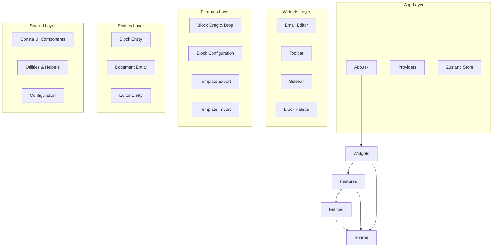
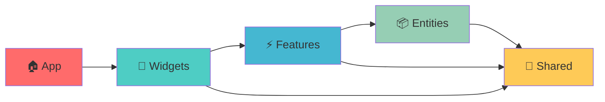

# 🎨 CREATIVE PHASE: FSD Architecture Design

## PROBLEM STATEMENT

Необходимо спроектировать детальную Feature-Sliced Design архитектуру для email builder приложения, которая:
- Обеспечит четкое разделение ответственности между слоями
- Поддержит интеграцию @dnd-kit и Consta UI
- Позволит легко масштабировать функциональность
- Сохранит совместимость с существующей структурой
- Обеспечит типобезопасность и переиспользование кода

## OPTIONS ANALYSIS

### Option 1: Классическая FSD с строгим разделением
**Описание**: Полное следование FSD методологии с четким разделением всех слоев
**Структура**:
```
src/
├── app/                    # Инициализация приложения
│   ├── providers/         # Контекст провайдеры (DnD, Theme, Store)
│   ├── store/            # Глобальный store (Zustand)
│   └── App.tsx           # Корневой компонент
├── pages/                 # Страницы (если нужны)
├── widgets/              # Комплексные UI блоки
│   ├── editor/           # Основной редактор
│   ├── toolbar/          # Панель инструментов
│   ├── sidebar/          # Боковая панель
│   └── block-palette/    # Палитра блоков
├── features/             # Бизнес-функции
│   ├── block-drag-drop/  # Drag & Drop блоков
│   ├── block-config/     # Конфигурация блоков
│   ├── template-export/  # Экспорт шаблонов
│   └── template-import/  # Импорт шаблонов
├── entities/             # Бизнес-сущности
│   ├── block/           # Сущность блока
│   ├── document/        # Сущность документа
│   └── editor/          # Сущность редактора
└── shared/               # Переиспользуемые модули
    ├── ui/              # UI компоненты (Consta-based)
    ├── lib/             # Утилиты и хелперы
    ├── api/             # API слой
    └── config/          # Конфигурация
```

**Pros**:
- Четкое разделение ответственности
- Легко понять структуру для новых разработчиков
- Отличная масштабируемость
- Соответствует FSD стандартам
- Простое тестирование

**Cons**:
- Может быть избыточно для текущего размера проекта
- Больше файлов и папок
- Сложнее миграция с текущей структуры

**Complexity**: High
**Implementation Time**: 3-4 недели

### Option 2: Упрощенная FSD с объединенными слоями
**Описание**: Адаптированная FSD с объединением некоторых слоев для упрощения
**Структура**:
```
src/
├── app/                    # Приложение + провайдеры
│   ├── providers/
│   ├── store/
│   └── App.tsx
├── features/              # Объединенные features + widgets
│   ├── email-editor/      # Основной редактор (widget-level)
│   ├── block-palette/     # Палитра блоков
│   ├── block-config/      # Конфигурация
│   └── drag-drop/         # Drag & Drop система
├── entities/              # Бизнес-сущности
│   ├── block/
│   ├── document/
│   └── editor/
└── shared/                # Общие модули
    ├── ui/               # Consta UI компоненты
    ├── lib/              # Утилиты
    └── config/           # Конфигурация
```

**Pros**:
- Проще для понимания и навигации
- Быстрее миграция
- Меньше вложенности
- Сохраняет основные принципы FSD

**Cons**:
- Менее четкое разделение widget/feature
- Может потребовать рефакторинга при росте
- Отклонение от стандартной FSD

**Complexity**: Medium
**Implementation Time**: 2-3 недели

### Option 3: Гибридная архитектура (FSD + текущая структура)
**Описание**: Постепенная миграция с сохранением части текущей структуры
**Структура**:
```
src/
├── app/                    # Новый FSD слой
├── features/              # Новые features в FSD стиле
├── entities/              # Новые entities
├── shared/                # Общие модули
└── legacy/                # Существующие компоненты
    ├── App/              # Текущая структура App
    ├── documents/        # Текущие documents
    └── getConfiguration/ # Текущие утилиты
```

**Pros**:
- Минимальный риск поломки
- Постепенная миграция
- Можно тестировать новую архитектуру параллельно
- Сохраняет работоспособность

**Cons**:
- Дублирование кода
- Сложность поддержки двух архитектур
- Непоследовательная структура
- Временное решение

**Complexity**: Medium
**Implementation Time**: 1-2 недели (начальная настройка)

## DECISION

**Выбираю Option 1: Классическая FSD с строгим разделением**

### Обоснование:
1. **Долгосрочная перспектива**: Проект будет расширяться, нужна масштабируемая архитектура
2. **Команда разработки**: FSD поможет новым разработчикам быстро понять структуру
3. **Интеграция технологий**: Четкое разделение упростит интеграцию @dnd-kit и Consta
4. **Качество кода**: Строгая архитектура повысит качество и поддерживаемость
5. **Стандарты**: Соответствие FSD методологии обеспечит best practices

### Ключевые архитектурные решения:

#### 1. Слой App
- **DnD Provider**: Обертка для @dnd-kit/core
- **Theme Provider**: Consta theme configuration
- **Store Provider**: Zustand store инициализация

#### 2. Слой Entities
- **Block Entity**: Типы блоков, схемы валидации, базовая логика
- **Document Entity**: Структура документа, операции с документом
- **Editor Entity**: Состояние редактора, выделение, настройки

#### 3. Слой Features
- **block-drag-drop**: Вся логика drag & drop
- **block-config**: Панели конфигурации блоков
- **template-export/import**: Экспорт/импорт шаблонов

#### 4. Слой Widgets
- **editor**: Основной редактор с canvas
- **toolbar**: Панель инструментов
- **sidebar**: Боковая панель с настройками
- **block-palette**: Палитра доступных блоков

#### 5. Слой Shared
- **ui**: Библиотека Consta компонентов
- **lib**: Утилиты для drag-drop, валидации, etc.
- **config**: Конфигурация приложения

## IMPLEMENTATION PLAN

### Этап 1: Создание базовой структуры (Неделя 1)
1. Создать папки FSD структуры
2. Настроить TypeScript paths и алиасы
3. Создать базовые index.ts файлы
4. Настроить ESLint правила для FSD

### Этап 2: Entities слой (Неделя 1-2)
1. Мигрировать схемы блоков в entities/block
2. Создать entities/document для структуры документа
3. Создать entities/editor для состояния редактора
4. Настроить типы и интерфейсы

### Этап 3: Shared слой (Неделя 2)
1. Создать shared/ui с Consta компонентами
2. Мигрировать утилиты в shared/lib
3. Создать shared/config для настроек

### Этап 4: Features слой (Неделя 2-3)
1. Создать features/block-drag-drop
2. Мигрировать панели конфигурации в features/block-config
3. Создать features для экспорта/импорта

### Этап 5: Widgets слой (Неделя 3)
1. Реорганизовать основной редактор в widgets/editor
2. Создать widgets/toolbar и widgets/sidebar
3. Создать widgets/block-palette

### Этап 6: App слой (Неделя 3-4)
1. Создать провайдеры в app/providers
2. Настроить app/store
3. Обновить корневой App.tsx

### Этап 7: Миграция и тестирование (Неделя 4)
1. Постепенная миграция компонентов
2. Обновление импортов
3. Тестирование функциональности
4. Удаление старой структуры

## VISUALIZATION



## DEPENDENCIES FLOW



🎨🎨🎨 EXITING CREATIVE PHASE - DECISION MADE 🎨🎨🎨

**Результат**: Выбрана классическая FSD архитектура с четким разделением слоев
**Следующий шаг**: Переход к проектированию Drag & Drop UX
