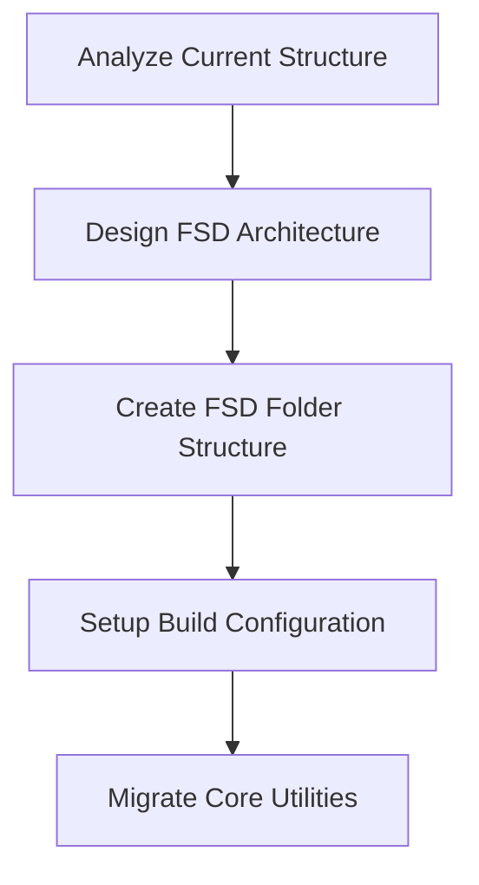

# Detailed Implementation Plan: Multi-Objective Redesign

## Strategic Implementation Approach

### Parallel Workstreams Strategy
Given the complexity of three major objectives, we'll implement using parallel workstreams with carefully managed dependencies:

1. **Foundation Stream**: FSD + Infrastructure
2. **UI Stream**: Consta Migration  
3. **Interaction Stream**: Drag & Drop Implementation

## Phase 1: Foundation & Architecture (Weeks 1-3)

### Week 1: Project Structure Analysis & Setup


#### Specific Implementation Steps:
1. **FSD Structure Creation**:
   ```
   src/
   ├── app/                 # Application layer
   │   ├── providers/       # Context providers
   │   ├── store/          # Global state
   │   └── App.tsx         # Root component
   ├── pages/              # Page layer (if needed)
   ├── widgets/            # Widget layer
   │   ├── editor/         # Main editor widget
   │   ├── toolbar/        # Toolbar widget
   │   └── sidebar/        # Sidebar widget
   ├── features/           # Feature layer
   │   ├── block-drag-drop/
   │   ├── block-config/
   │   ├── template-preview/
   │   └── import-export/
   ├── entities/           # Entity layer
   │   ├── block/
   │   ├── document/
   │   └── editor/
   └── shared/             # Shared layer
       ├── ui/             # UI components
       ├── lib/            # Utilities
       ├── api/            # API layer
       └── config/         # Configuration
   ```

2. **Technology Stack Validation**:
   ```bash
   # Install dependencies
   npm install @dnd-kit/core @dnd-kit/sortable @dnd-kit/utilities
   npm install @consta/uikit @consta/icons
   
   # Create proof of concept
   # Test drag-and-drop basic functionality
   # Test Consta components rendering
   # Verify build process
   ```

### Week 2: Entity Layer Implementation
```typescript
// entities/block/model/types.ts
export interface BlockEntity {
  id: string;
  type: BlockType;
  data: BlockData;
  children?: string[];
}

// entities/block/model/store.ts
export const useBlockStore = create<BlockStore>((set, get) => ({
  blocks: {},
  addBlock: (block) => set(state => ({ 
    blocks: { ...state.blocks, [block.id]: block }
  })),
  // ... other block operations
}));

// entities/document/model/types.ts
export interface DocumentEntity {
  id: string;
  rootBlockId: string;
  blocks: Record<string, BlockEntity>;
  metadata: DocumentMetadata;
}
```

### Week 3: Shared Layer & Basic UI Migration
```typescript
// shared/ui/Button/index.tsx (Consta-based)
import { Button as ConstaButton } from '@consta/uikit/Button';

export const Button = ({ children, ...props }) => (
  <ConstaButton {...props}>{children}</ConstaButton>
);

// shared/lib/drag-drop/types.ts
export interface DragItem {
  id: string;
  type: string;
  data: any;
}

export interface DropResult {
  success: boolean;
  position?: number;
  containerId?: string;
}
```

## Phase 2: Core Drag & Drop Implementation (Weeks 4-6)

### Week 4: DnD Infrastructure
```typescript
// app/providers/DndProvider.tsx
import { DndContext, DragEndEvent, DragOverEvent } from '@dnd-kit/core';

export const DndProvider = ({ children }) => {
  const handleDragEnd = (event: DragEndEvent) => {
    // Implement drag end logic
  };

  return (
    <DndContext onDragEnd={handleDragEnd}>
      {children}
    </DndContext>
  );
};

// features/block-drag-drop/model/store.ts
interface DragState {
  activeDragItem: DragItem | null;
  dragOverContainer: string | null;
  isDragging: boolean;
}

export const useDragStore = create<DragState>((set) => ({
  activeDragItem: null,
  dragOverContainer: null,
  isDragging: false,
  // ... drag actions
}));
```

### Week 5: Draggable Blocks Implementation
```typescript
// features/block-drag-drop/ui/DraggableBlock.tsx
import { useDraggable } from '@dnd-kit/core';
import { CSS } from '@dnd-kit/utilities';

export const DraggableBlock = ({ block, children }) => {
  const { attributes, listeners, setNodeRef, transform } = useDraggable({
    id: block.id,
    data: { type: block.type, ...block.data }
  });

  const style = {
    transform: CSS.Translate.toString(transform),
  };

  return (
    <div ref={setNodeRef} style={style} {...listeners} {...attributes}>
      {children}
    </div>
  );
};

// widgets/editor/ui/BlockWrapper.tsx (Consta-styled)
import { Card } from '@consta/uikit/Card';
import { IconDragDrop } from '@consta/icons/IconDragDrop';

export const BlockWrapper = ({ block, children, isDragging }) => (
  <Card 
    border={isDragging} 
    shadow={isDragging}
    className="block-wrapper"
  >
    <div className="drag-handle">
      <IconDragDrop size="s" />
    </div>
    {children}
  </Card>
);
```

### Week 6: Droppable Containers & Sorting
```typescript
// features/block-drag-drop/ui/DroppableContainer.tsx
import { useDroppable } from '@dnd-kit/core';
import { SortableContext, verticalListSortingStrategy } from '@dnd-kit/sortable';

export const DroppableContainer = ({ containerId, children, items }) => {
  const { setNodeRef } = useDroppable({ id: containerId });

  return (
    <div ref={setNodeRef}>
      <SortableContext items={items} strategy={verticalListSortingStrategy}>
        {children}
      </SortableContext>
    </div>
  );
};

// features/block-drag-drop/ui/SortableBlock.tsx
import { useSortable } from '@dnd-kit/sortable';

export const SortableBlock = ({ block }) => {
  const {
    attributes,
    listeners,
    setNodeRef,
    transform,
    transition,
  } = useSortable({ id: block.id });

  const style = {
    transform: CSS.Transform.toString(transform),
    transition,
  };

  return (
    <div ref={setNodeRef} style={style} {...attributes} {...listeners}>
      <BlockComponent block={block} />
    </div>
  );
};
```

## Phase 3: UI Consta Migration (Weeks 7-9)

### Week 7: Core Component Migration
```typescript
// Migration mapping strategy
const migrationMap = {
  // Material-UI -> Consta
  'Button': '@consta/uikit/Button',
  'TextField': '@consta/uikit/TextField', 
  'Select': '@consta/uikit/Select',
  'Drawer': '@consta/uikit/Sidebar',
  'Dialog': '@consta/uikit/Modal',
  'Menu': '@consta/uikit/ContextMenu',
  // ... complete mapping
};

// shared/ui/index.ts - Unified UI exports
export { Button } from './Button';
export { TextField } from './TextField';
export { Select } from './Select';
// ... other components
```

### Week 8: Layout & Navigation Migration
```typescript
// widgets/sidebar/ui/Sidebar.tsx
import { Sidebar } from '@consta/uikit/Sidebar';

export const EditorSidebar = ({ isOpen, onClose, children }) => (
  <Sidebar 
    isOpen={isOpen} 
    onClose={onClose}
    hasOverlay
    position="right"
  >
    {children}
  </Sidebar>
);

// widgets/toolbar/ui/Toolbar.tsx  
import { Header } from '@consta/uikit/Header';

export const EditorToolbar = ({ actions }) => (
  <Header 
    brand="Email Builder"
    menu={actions}
  />
);
```

### Week 9: Theme & Design System Integration
```typescript
// app/providers/ThemeProvider.tsx
import { Theme, presetGpnDefault } from '@consta/uikit/Theme';

export const ThemeProvider = ({ children }) => (
  <Theme preset={presetGpnDefault}>
    {children}
  </Theme>
);

// shared/config/theme.ts
export const customTheme = {
  ...presetGpnDefault,
  color: {
    ...presetGpnDefault.color,
    primary: '#0078d4', // Custom primary color
  },
};
```

## Phase 4: Feature Integration (Weeks 10-12)

### Week 10: Block Palette Redesign
```typescript
// features/block-palette/ui/BlockPalette.tsx
import { Card } from '@consta/uikit/Card';
import { Grid } from '@consta/uikit/Grid';

export const BlockPalette = ({ blocks, onBlockDrag }) => (
  <Card>
    <Grid cols={4} gap="s">
      {blocks.map(block => (
        <DraggableBlockButton 
          key={block.type}
          block={block}
          onDragStart={onBlockDrag}
        />
      ))}
    </Grid>
  </Card>
);

// features/block-palette/ui/DraggableBlockButton.tsx
export const DraggableBlockButton = ({ block, onDragStart }) => {
  const { listeners, setNodeRef, transform } = useDraggable({
    id: `palette-${block.type}`,
    data: { source: 'palette', ...block }
  });

  return (
    <Button
      ref={setNodeRef}
      {...listeners}
      style={{ transform: CSS.Translate.toString(transform) }}
      label={block.label}
      iconLeft={block.icon}
    />
  );
};
```

### Week 11: Advanced Drag Features
```typescript
// features/block-drag-drop/lib/collision-detection.ts
import { closestCenter, pointerWithin, rectIntersection } from '@dnd-kit/core';

export const customCollisionDetection = (args) => {
  // Custom collision detection logic for nested containers
  const pointerIntersections = pointerWithin(args);
  const intersections = rectIntersection(args);
  
  return pointerIntersections.length > 0 ? pointerIntersections : intersections;
};

// features/block-drag-drop/ui/DragOverlay.tsx
import { DragOverlay } from '@dnd-kit/core';

export const CustomDragOverlay = ({ activeDragItem }) => (
  <DragOverlay>
    {activeDragItem && (
      <Card shadow border className="drag-preview">
        <BlockComponent block={activeDragItem} />
      </Card>
    )}
  </DragOverlay>
);
```

### Week 12: Performance & Accessibility
```typescript
// features/block-drag-drop/lib/performance.ts
import { useMemo, useCallback } from 'react';

export const useOptimizedDrag = (items) => {
  const itemIds = useMemo(() => items.map(item => item.id), [items]);
  
  const handleDragEnd = useCallback((event) => {
    // Optimized drag end handling
  }, []);

  return { itemIds, handleDragEnd };
};

// features/block-drag-drop/lib/accessibility.ts
export const announcements = {
  onDragStart: ({ active }) => `Started dragging ${active.data.current?.type} block`,
  onDragOver: ({ active, over }) => `${active.data.current?.type} block is over ${over?.id}`,
  onDragEnd: ({ active, over }) => `${active.data.current?.type} block dropped on ${over?.id}`,
};
```

## Technology Validation Checkpoints

### @dnd-kit Validation
```bash
# Create minimal drag-and-drop example
npm install @dnd-kit/core @dnd-kit/sortable
# Test basic draggable/droppable functionality
# Verify touch support
# Test accessibility features
```

### Consta Validation  
```bash
# Install Consta packages
npm install @consta/uikit @consta/icons
# Replace one Material-UI component
# Test theme integration
# Verify responsive behavior
```

### FSD Validation
```bash
# Create FSD folder structure
# Test import/export patterns
# Verify layer dependencies
# Test build process
```

## Next Steps Priority Order

1. **IMMEDIATE (Week 1)**: Technology validation and FSD structure setup
2. **HIGH (Weeks 2-3)**: Entity layer and shared UI foundation
3. **CRITICAL (Weeks 4-6)**: Core drag-and-drop implementation
4. **IMPORTANT (Weeks 7-9)**: Consta migration for visual consistency
5. **ENHANCEMENT (Weeks 10-12)**: Advanced features and optimization

## Creative Phases Identified

1. **FSD Architecture Design** - Layer organization and dependency management
2. **Drag & Drop UX Design** - Interaction patterns and visual feedback
3. **Consta Integration Design** - Theme customization and component adaptation
4. **Block Palette UX** - Intuitive draggable interface design

## Risk Mitigation Implementation

- **Gradual Migration**: Maintain working application at each phase
- **Feature Flags**: Toggle new functionality during development
- **Parallel Branches**: Separate workstreams with regular integration
- **Comprehensive Testing**: Unit, integration, and E2E tests at each phase
- **Performance Monitoring**: Continuous performance benchmarking
